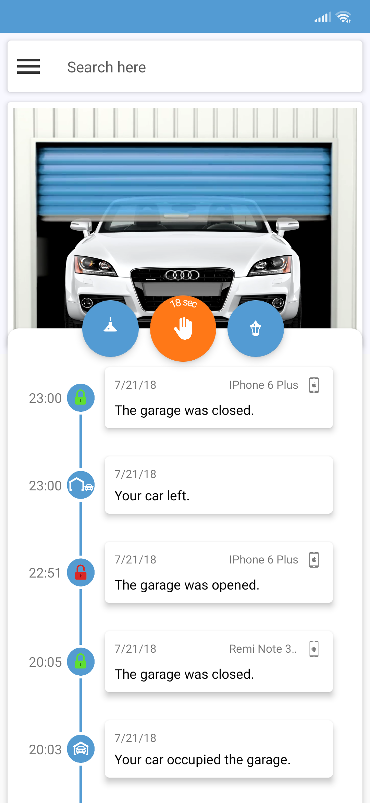

# SmartGarage

A **garage control** app that relies on **Firebase** as a backing store.

It allows for signing-up with multiple accounts. Different kinds of events, and the related users are stored in Firebase. The events can also be searched historically.
Also has support for authentification before opening the door. An **Arduino** can be used to communicate with the app through Firebase.

## Installation

Clone this repository and import into **Android Studio**
```bash
git clone git@github.com:stormset/SmartGarage.git
```

## Configuration

### Remarks

To be able to get the app running you need to sign-in into [Firebase](https://console.firebase.google.com) and create a project.
<br>
After that download your ```google-services.json``` file as [shown here](https://support.google.com/firebase/answer/7015592), and place it into the ```app``` folder.
<br>

***The code is quite monolithic, and should be modularized.*** *It's an old project of mine.*

### Firebase scheme

**The data is stored in the following format:**
```json
{
  "history": {
    <time_stamp>: {
      "event": <event_id>,
      "phone_name": <device_identifier>,
      "phone_os": <os_type>
    },
  },
  "state": "request,ack,state,car_pos,inside_light,outside_light,time"
}
```
Where the items of the state are comma-separated, and the values are respectively:

```request``` - Indicates the request to open/close the garage door.<br>
```ack``` - Lets the app know that the request can be accepted, and it's execution is possible (manipulated by Arduino).<br>
```state``` - The state of the door. Allowed values are: ```0 - opened``` ```1 - closed``` ```2 - opening``` ```3 - closing``` ```4 - paused```<br>
```inside_light``` - The inside light state.<br>
```outside_light``` - The outside (driveway) light state.<br>
```time``` - Time spent executing an opening/closing action (used to sync the door position to the animation).


**e.g.:**
```json
{
  "history": {
    "1532206302": {
      "event": "5529",
      "phone_name": "IPhone 6 Plus",
      "phone_os": "1"
    },
    "1532206802": {
      "event": 9701
    },
    "1532206822": {
      "event": "2803",
      "phone_name": "IPhone 6 Plus",
      "phone_os": "1"
    }
  },
  "state": "0,0,0,1,1,0,0"
}
```

## Build variants

Use the Android Studio *Build Variants* button to choose between **production** and **staging** flavors combined with debug and release build types

## Screenshots
<p float="left">



</p>
<br>
<p float="left">


</p>

## Contributing

1. Fork it
2. Create your feature branch (git checkout -b my-new-feature)
3. Commit your changes (git commit -m 'Add some feature')
4. Push your branch (git push origin my-new-feature)
5. Create a new Pull Request
